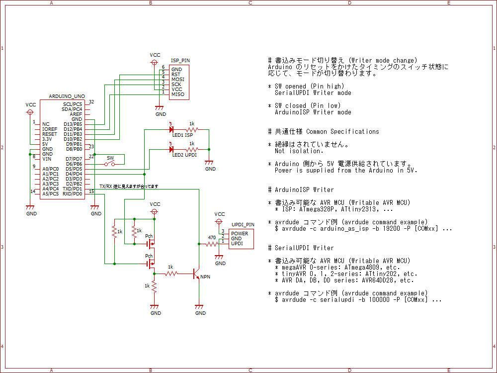
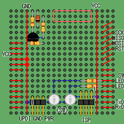
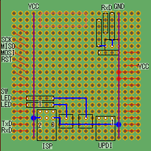

# AVR-ISP-UPDI

実物は製作中のため、動作は未確認です。

ATtiny202 などの新しい AVR マイコンでは、UPDI と呼ばれるプログラミング・デバッグインターフェースが採用されており、USB-UART 変換アダプタを書込み器として利用することができます。  
従来の ISP (ICSP) と新しい UPDI の両方に対応した AVR マイコン書込み器を Arduino で作成しました。  
スケッチプログラムは、スケッチ例 (Example) の ArduinoISP を改造したものを利用しています。

ArduinoISP 参考サイト
* n.mtng.org - [ArduinoをAVRプログラマ(ISP: In-System Programmer)として使う](https://n.mtng.org/ele/arduino/ArduinoISP.html)
* ikeji blog - [ArduinoISPの罠](https://blog.ikejima.org/make/arduino/2022/02/12/arduinoisp-tips.html)
* Qiita @tadfmac - [ArduinoISPを高速化する](https://qiita.com/tadfmac/items/e93e2e6f91ce9dba7114)

SerialUPDI 参考サイト
* ikkei blog - [USB to UPDI](https://blog.goo.ne.jp/jh3kxm/e/9bf429adc58bc09dc164e5ef30397f1f)
* GitHub - [SpenceKonde/AVR-Guidance - /UPDI/jtag2updi.md](https://github.com/SpenceKonde/AVR-Guidance/blob/master/UPDI/jtag2updi.md)

## Circuit design 回路設計 

作図ソフトウェアは BSch3V です。

* BSch3V - https://www.suigyodo.com/online/schsoft.htm

### Simple version


## Board design 基板設計

Arduino 用ユニバーサル基板（Sunhayato UB-ARD03）で製作しています。  
作図ソフトウェアは marmelo です。

* marmelo - https://motchy99.blog.fc2.com/blog-entry-70.html

### Simple version




## Arduino Sketch スケッチプログラム

[改造した ArduinoISP](./ArduinoISP_modify/ArduinoISP_modify.ino) を Arduino へ書き込むことで、書込み器として使えるようになります。  
書込み器のモードは、Arduino リセット時のスイッチ状態によって切り替わります。

Arduino UNO R3 と avrdude で動作を確認しています。

### ISP (ArduinoISP) モード

SW を押したままリセットをかけてください。D4 に接続された LED1 が点灯します。

```:avrdude コマンド例
avrdude -c avrisp -b 19200 -P [ポート番号] ...
```

### UPDI (SerialUPDI) モード

SW を押さずにリセットをかけてください。D5 に接続された LED2 が点灯します。

```:avrdude コマンド例
avrdude -c serialupdi -b 225000 -P [ポート番号] ...
```

