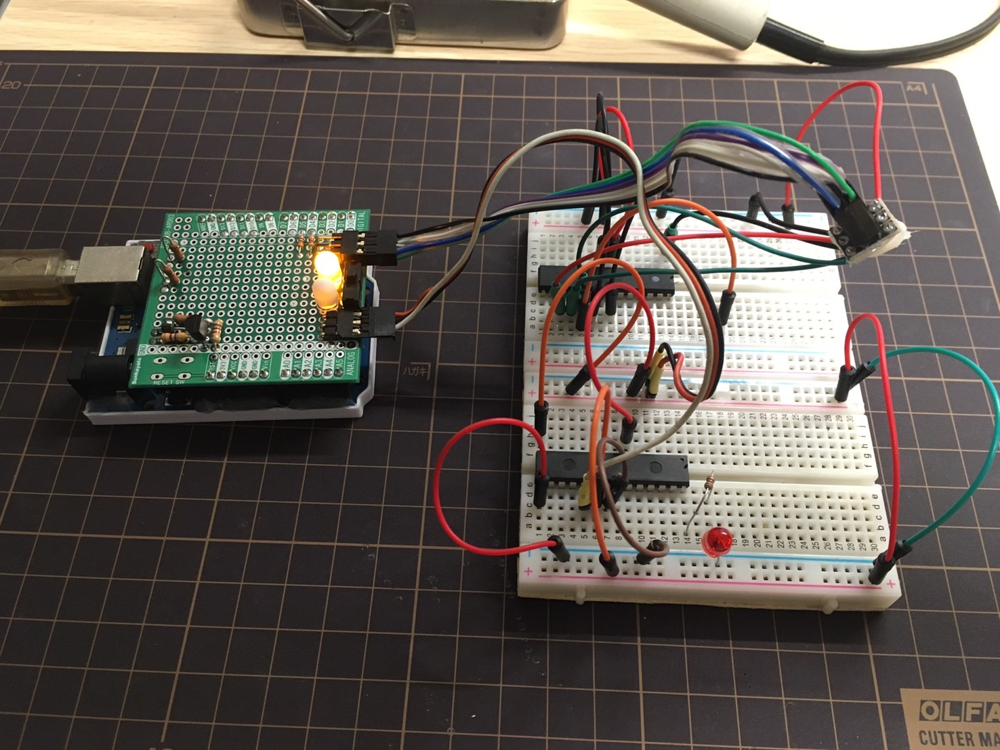
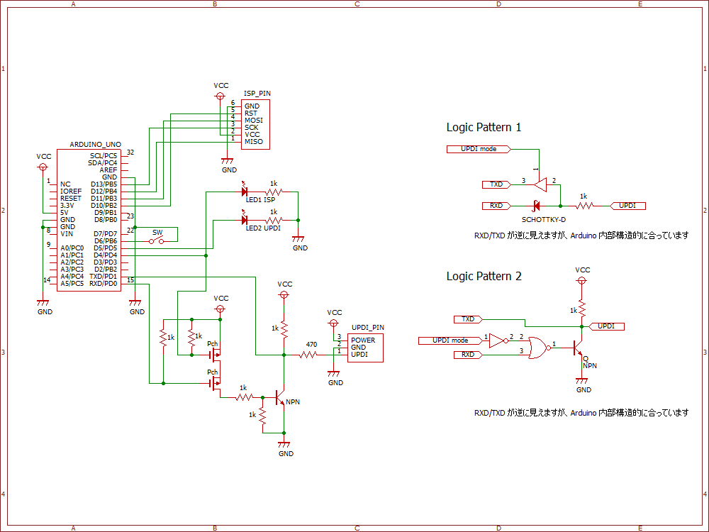

# AVR-ISP-UPDI

ATtiny202 などの新しい AVR マイコンでは、UPDI と呼ばれるインターフェースが採用されており、USB-UART 変換アダプタを書込み器として利用することができます。  
従来の ISP (ICSP) と新しい UPDI の両方に対応した AVR マイコン書込み器を Arduino で作成しました。  
スケッチプログラムは、スケッチ例 (Example) の ArduinoISP を改造したものを利用しています。

ArduinoISP 参考サイト
* n.mtng.org - [ArduinoをAVRプログラマ(ISP: In-System Programmer)として使う](https://n.mtng.org/ele/arduino/ArduinoISP.html)
* ikeji blog - [ArduinoISPの罠](https://blog.ikejima.org/make/arduino/2022/02/12/arduinoisp-tips.html)

SerialUPDI 参考サイト
* ikkei blog - [USB to UPDI](https://blog.goo.ne.jp/jh3kxm/e/9bf429adc58bc09dc164e5ef30397f1f)
* GitHub - [SpenceKonde/AVR-Guidance - /UPDI/jtag2updi.md](https://github.com/SpenceKonde/AVR-Guidance/blob/master/UPDI/jtag2updi.md)



## Circuit design 回路設計

作図ソフトウェアは BSch3V です。

* BSch3V - https://www.suigyodo.com/online/schsoft.htm

仕様は次のとおりです。
* 絶縁はされていません / Not isolation.
* Arduino 側から 5V が電源供給されています / Power is supplied from the Arduino in 5V.
* スイッチに応じて書き込みモード (UPDI or ISP) を切り替えられます / Programmer mode can be changed with a switch.



## Board design 基板設計

Arduino 用ユニバーサル基板（Sunhayato UB-ARD03）で製作しています。  
作図ソフトウェアは marmelo です。

* marmelo - https://motchy99.blog.fc2.com/blog-entry-70.html

画像に記載していない配線および部品が多数存在しますので、注意が必要です。


## Arduino Sketch スケッチプログラム

[改造した ArduinoISP](./ArduinoISP_modify/ArduinoISP_modify.ino) を Arduino へ書き込むことで、書込み器として使えるようになります。書き込む際は、スタック基板を外しておかないと失敗する可能性があります。  
書込み器のモードは、Arduino リセット時のスイッチ状態によって切り替わります。  
スイッチング回路がある関係であまり高速なスピードは設定できません。

Arduino UNO R3 と avrdude で動作を確認しています。

### ISP (ArduinoISP) モード

Arduino リセットをかけたとき、SW が閉じていると ISP モードになり、 D4 に接続された LED が点灯します。

When you reset the Arduino, if the SW is closed, it will enter ISP mode and the LED connected to D4 will light up.

```:avrdude コマンド例
avrdude -c arduino_as_isp -b 19200 -P [ポート番号] ...
```

### UPDI (SerialUPDI) モード

Arduino リセットをかけたとき、SW が開いていると UPDI モードになり、 D5 に接続された LED が点灯します。  

When you reset the Arduino, if the SW is opened, it will enter UPDI mode and the LED connected to D5 will light up.

```:avrdude コマンド例
avrdude -c serialupdi -b 100000 -P [ポート番号] ...
```
